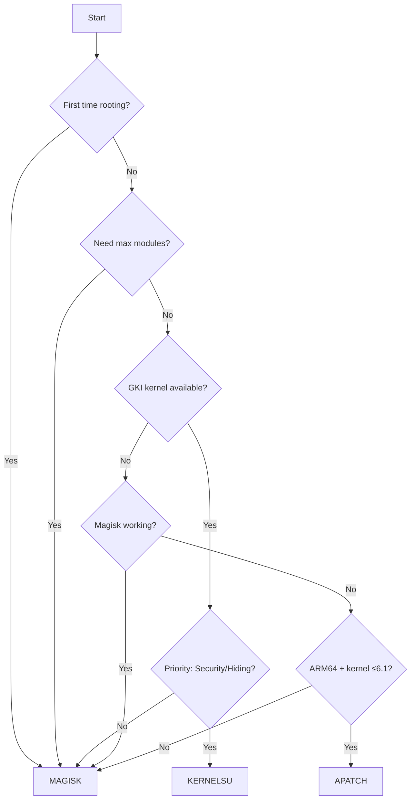

# Root Framework Comparison 2026

Comprehensive analysis of Magisk, KernelSU, and APatch to help you choose the right root solution for your Android device.

## Quick Navigation

- [Quick Comparison](#quick-comparison)
- [Framework Analysis](#framework-analysis)
- [Device Recommendations](#device-recommendations)
- [Technical Deep Dive](#technical-deep-dive)
- [Migration Guide](#migration-guide)
- [Decision Framework](#decision-framework)

**Related Guides:**
- [Main Rooting Guide](./index.md)
- [Magisk Installation](./magisk-guide.md)
- [KernelSU Installation](./kernelsu-guide.md)
- [APatch Installation](./apatch-guide.md)

---

## Quick Comparison

| Aspect | Magisk | KernelSU | APatch |
|--------|--------|----------|---------|
| **Target Users** | Most users | Advanced users | Tinkerers / edge cases |
| **Setup Difficulty** | Easy | Moderate | Moderate |
| **Official Support** | Android 6.0+ | GKI 2.0 (kernel 5.10+); older kernels (4.14+) with manual builds | ARM64 only, kernel 3.18–6.12 |
| **Kernel Requirements** | Stock/custom boot image patching | Kernel support required (GKI or LKM) | KernelPatch compatibility |
| **Module System** | Built-in magic mount | Metamodule architecture - requires metamodule install for modules to mount | APModule (Magisk-like) + KPM (kernel-level) |
| **Root Hiding** | Good with careful setup | Often strong in practice | Device-dependent |
| **OTA Updates** | Requires re-patch | Can survive some OTA flows via LKM, not guaranteed | Initial support for A/B upgrade after OTA |
| **Development Status** | Active upstream | Very active | Active |
| **Community Size** | Largest (~50k+ GitHub stars) | Growing rapidly (~13k+ stars) | Small (~5k+ stars) |
| **Best Feature** | Ecosystem and compatibility | Metamodule system + kernel-level control and profiles | Combines Magisk's easy boot.img install with KernelSU's kernel patching |****
| **Latest Version** |  |  |  |

### Quick Decision Matrix

| Choose Framework | When You Need |
|-----------------|---------------|
| **Magisk** | • First-time rooting • Broadest module/guide coverage • Fast troubleshooting via largest community |
| **KernelSU** | • GKI device or supported kernel available • Fine-grained app profiles & kernel-level control • Metamodule flexibility for mounting strategies |
| **APatch** | • Magisk/KernelSU path is blocked • Compatible ARM64 device (kernel 3.18–6.1 most reliable) • Need kernel-level patching (KPM) without kernel source |

---

## Framework Analysis

### Magisk
**The Industry Standard**

**Architecture:** Boot image modification with systemless implementation via Zygisk. Over 40% of native code rewritten in Rust, with more subsystem rewrites planned.

**Strengths:**
- Largest module ecosystem and compatibility footprint
- Extensive documentation and community support
- Broad device compatibility (Android 6.0+)
- Mature, stable codebase with active Rust migration
- Supports new sepolicy binary format introduced in Android 16 QPR2

**Limitations:**
- Requires boot image re-patching after OTA
- Play Integrity bypass is inconsistent and changes frequently

**Installation:** [📖 Magisk Guide](./magisk-guide.md)

---

### KernelSU
**Kernel-Level Root Solution**

**Architecture:** Direct kernel integration via GKI or LKM mode, with metamodule-based pluggable architecture that transfers module mounting from core to pluggable modules.

**Strengths:**
- Runs inside the Linux kernel; only permitted apps can access or see su
- Customization of su's uid, gid, groups, capabilities, and SELinux rules
- Metamodule system — plugin-based extension that allows complete customization of module management; avoids being a fragile detection point
- Multiple metamodule options: meta-overlayfs (official reference), Meta-Hybrid Mount (Rust-native, combines OverlayFS + Magic Mount)
- LKM mode loads kernel module without replacing original kernel
- Supports android12–16 GKI kernels (5.10 through 6.12)

**Limitations:**
- No longer has built-in module mounting; fresh installations require a metamodule for modules to function
- Device availability depends on kernel/community ports
- More complex initial setup

**Installation:** [📖 KernelSU Guide](./kernelsu-guide.md)

---

### APatch
**Alternative Patching Method**
**Architecture:** KernelPatch-based root combining Magisk's convenient boot.img install with KernelSU's powerful kernel patching. Runs in kernel space with greater concealment; only permitted apps may access or see su.

**Strengths:**
- Works with just your stock boot.img — no kernel source needed
- Magisk-like modules (APModule) plus kernel code injection (KPM) with inline-hook and syscall-table-hook
- SuperKey system with privileges higher than root access
- Initial A/B OTA upgrade support
- Switched to Magic Mount; OverlayFS and Lite Mode available as optional toggles

**Limitations:**
- ARM64 only
- KernelPatch doesn't support kernel 6.6 yet (fix in progress; 6.6 tested only on Xiaomi and OnePlus)
- Documentation not quite complete and content may change
- Smallest module ecosystem and community

**Installation:** [📖 APatch Guide](./apatch-guide.md)

---

## Device Recommendations

### Major Manufacturers

| Brand | Primary Choice | Alternative | Critical Notes |
|-------|---------------|-------------|----------------|
| **Google Pixel** | Magisk | KernelSU¹ | Best overall support |
| **Samsung Galaxy** | Magisk | APatch² | ⚠️ Knox trips permanently; Samsung KNOX devices may not work with LKM mode |
| **Xiaomi/Redmi/POCO** | Magisk³ | KernelSU⁴ | ROM-dependent |
| **OnePlus** | Magisk | KernelSU | Both work excellently |
| **Nothing Phone** | Magisk | KernelSU | Active development |
| **Motorola** | Magisk | APatch | Check bootloader policy per region |
| **ASUS ROG/Zenfone** | Magisk | KernelSU | Gaming optimizations available |
| **Realme/OPPO** | Magisk | APatch | Region/firmware quirks common |

¹ Requires custom kernel or GKI-compatible device
² For problematic devices
³ Stock MIUI/HyperOS
⁴ Custom ROMs preferred

::: warning SAMSUNG KNOX
Bootloader unlock permanently trips Knox eFuse, disabling Samsung Pay, Secure Folder, and Samsung Pass forever — regardless of root method.
:::

---

## Technical Deep Dive

### Security Architecture

| Security Feature | Magisk | KernelSU | APatch |
|-----------------|--------|----------|---------|
| **Permission Model** | App-based | Profile-based (uid, gid, groups, capabilities, SELinux) | SuperKey-based (SuperCall syscall with credential) |
| **Namespace Isolation** | No | Yes (App Profiles) | No |
| **Module Mounting** | Built-in magic mount | Delegated to metamodules (pluggable architecture) | Magic Mount default; OverlayFS optional |
| **Module Verification** | Varies by source | Only one metamodule at a time; structured flow | Varies by source |
| **Root Access Control** | Standard su | Only permitted apps can access or see su | Only permitted apps may access or see su |

### Module Ecosystem

| Metric | Magisk | KernelSU | APatch |
|--------|--------|----------|---------|
| **Available Modules** | Largest catalog | Medium, growing; Magisk modules work when metamodule installed | Smallest; APModule + KPM |
| **Mounting Strategy** | Built-in magic mount | Metamodule-based: meta-overlayfs (OverlayFS) or meta-hybrid (OverlayFS + Magic Mount) | Magic Mount default; OverlayFS/Lite Mode toggleable |
| **Unique Capability** | Native Zygisk | Plugin-based metamodule customization | KPM: kernel code injection, inline-hook, syscall-table-hook |
| **Update Frequency** | Regular | Very active | Active |

### Root Detection Evasion

| Detection Method | Magisk | KernelSU | APatch |
|-----------------|--------|----------|---------|
| **Basic Integrity** | Sometimes possible⁵ | Sometimes possible⁵ | Sometimes possible⁵ |
| **Device Integrity** | Inconsistent | Inconsistent | Inconsistent |
| **Strong Integrity** | Generally unreliable on unlocked/rooted devices | Generally unreliable | Generally unreliable |
| **Banking Apps** | App/device dependent | App/device dependent | App/device dependent |
| **Gaming Anti-Cheat** | Hit/miss | Hit/miss | Hit/miss |

⁵ Typically requires extra tooling/modules (Play Integrity Fix, Tricky Store, etc.) and frequent retuning as detections change.

---

## Migration Guide

### Pre-Migration Checklist
- [ ] Full device backup created
- [ ] Module list documented
- [ ] Stock boot image available
- [ ] Recovery access confirmed
- [ ] Critical apps tested

### Migration Paths

<b>Magisk → KernelSU</b> (1–2 hours)

1. **Backup & Document** (cloud/app exports + internal storage copy)
2. **Uninstall Magisk completely**
3. **Flash KernelSU-enabled kernel** (GKI or LKM mode)
4. **Install KernelSU Manager**
5. **Install a metamodule** (e.g., meta-overlayfs or hybrid_mount) — required for modules to function
6. **Reinstall compatible modules**
7. **Configure app profiles**

<b>Magisk → APatch</b> (30–60 minutes)

1. **Create full backup**
2. **Uninstall Magisk**
3. **Patch boot image with APatch Manager** (set strong SuperKey)
4. **Flash patched boot image**
5. **Install APatch Manager**
6. **Verify root access & install modules**

<b>KernelSU → Magisk</b> (30–60 minutes)

1. **Document KernelSU modules**
2. **Flash stock/ROM boot image**
3. **Patch with Magisk**
4. **Flash patched boot**
5. **Reinstall modules from Magisk repo**

---

## Decision Framework

### Use Case Scenarios

| Scenario | Recommended | Reason |
|----------|-------------|---------|
| **Daily Driver Phone** | Magisk | Stability, largest support & ecosystem |
| **Gaming Device** | Magisk / KernelSU | Depends on title anti-cheat behavior |
| **Development/Testing** | KernelSU | Metamodule flexibility, App Profiles, kernel-level control |
| **Banking Phone** | No root preferred | Highest reliability for financial apps |
| **Kernel-Level Patching** | APatch | KPM allows kernel code injection without source |
| **Problematic Device** | APatch | Alternative approach when others fail |
| **Learning Rooting** | Magisk | Best documentation & community guides |

---

## Frequently Asked Questions

<b>Essential FAQs</b>

**Q: Can I switch between methods?**  
A: Yes, but requires uninstalling current method and clean installation of new one.

**Q: Which has best Play Integrity bypass?**  
A: None can guarantee passing all tiers. Results vary by device fingerprint, ROM state, bootloader status, and current detection updates.

**Q: Do all Magisk modules work on KernelSU?**  
A: No. Many work, but compatibility depends on module design and whether required metamodules are present.

**Q: Which method is safest?**  
A: All are safe when properly installed. KernelSU offers best architectural security.

**Q: Will OTA updates work?**  
A: Expect to re-check root after every OTA on all frameworks. Some KernelSU setups survive specific OTA flows, but this is not guaranteed.

**Q: Battery impact?**  
A: Negligible for all methods. Module choice matters more.

---

## Community Resources

### Official Channels
- **Magisk:** [GitHub](https://github.com/topjohnwu/Magisk) | [Official Docs](https://topjohnwu.github.io/Magisk/) | [XDA](https://forum.xda-developers.com/f/magisk.5903/)
- **KernelSU:** [GitHub](https://github.com/tiann/KernelSU) | [Docs](https://kernelsu.org/) | [Telegram](https://t.me/KernelSU)
- **APatch:** [GitHub](https://github.com/bmax121/APatch) | [Docs](https://apatch.dev/) | [Telegram](https://t.me/APatchGroup)

### General Support
- [XDA Developers Forums](https://forum.xda-developers.com/)
- [r/AndroidRoot](https://www.reddit.com/r/androidroot/)
- Device-specific Telegram groups

---

## Final Recommendations

### For Most Users
**Start with Magisk** - best documentation, easiest recovery path, broad support

### For Power Users
**Consider KernelSU** if your device/kernel is supported and you want deeper root control

### For Edge Cases
**Try APatch** when Magisk/KernelSU paths are blocked on your specific firmware

### Universal Tips
1. Research device-specific quirks first
2. Maintain proper backups always
3. Test one module at a time
4. Join device-specific communities
5. Keep stock boot image handy

---

> [!TIP]
> Don't want to root? Check out our [Non-Root Alternatives Guide](../non-root-alternatives.md) for alternatives to enhance your Android experience without rooting.

---

## Next Steps

1. **Choose your method** based on this comparison
2. **Follow installation guide:**
   - [Magisk Guide](./magisk-guide.md)
   - [KernelSU Guide](./kernelsu-guide.md)
   - [APatch Guide](./apatch-guide.md)
3. **Install essential apps:** [Root Apps Collection](../apps-and-modules/)
4. **Get support:** Join relevant communities

---

*Remember: The "best" method depends entirely on your specific device, technical comfort, and use case. When in doubt, start with Magisk.*